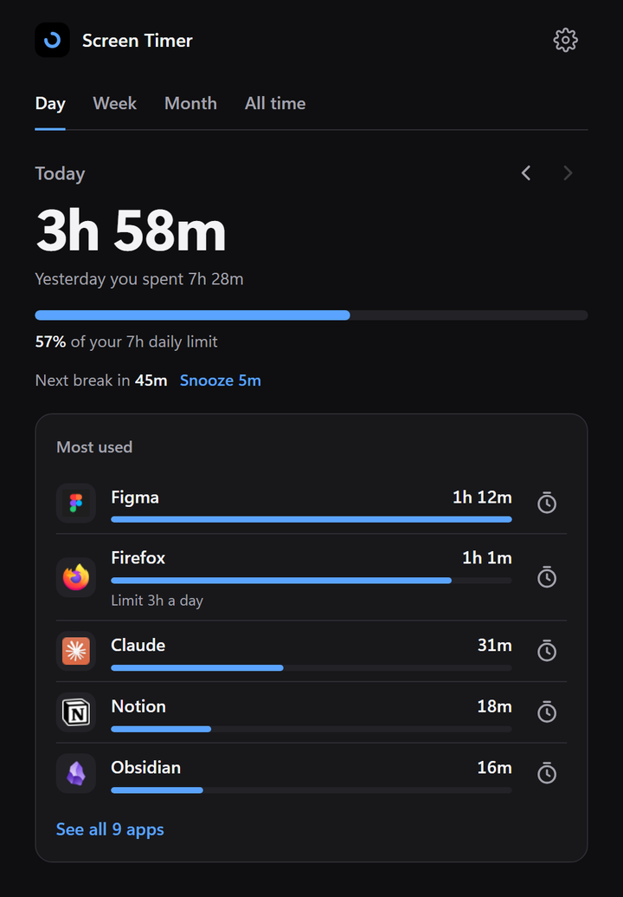
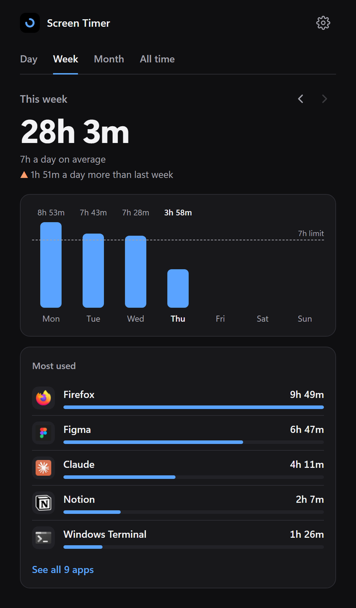
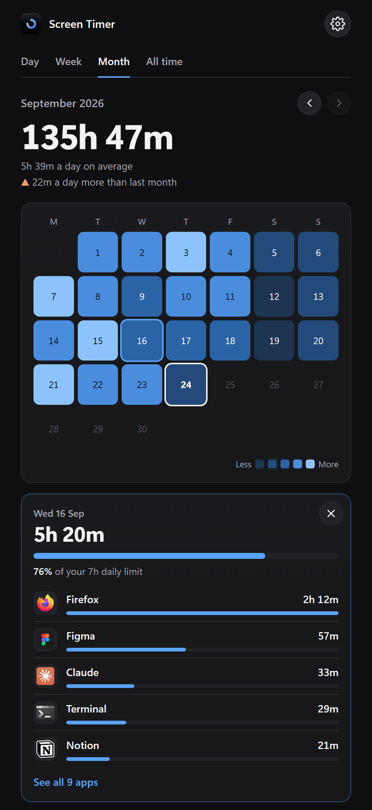
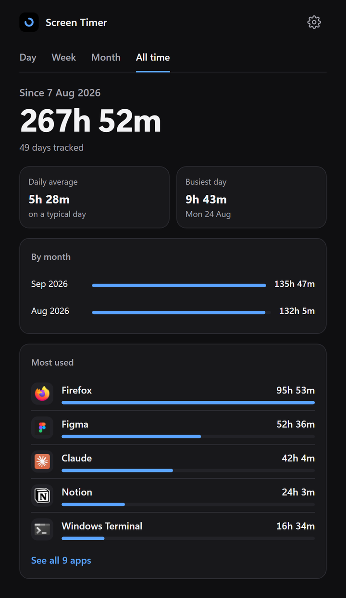

# Screen Timer for Windows

See how long you spend on your laptop, and on which apps. It sits quietly in
your taskbar and reminds you to take breaks.

Free, open source and private. No account, and nothing ever leaves your
computer.

**Get it from Releases**, on the right side of this page, or
[build it yourself](#for-developers) from the code here.

<sub>For Windows 10 and 11 · about 17 MB · no installer</sub>

<table>
<tr>
<td></td>
<td></td>
</tr>
<tr>
<td></td>
<td></td>
</tr>
</table>

<sub>Screenshots use made-up demo hours.</sub>

---

## Start in 3 steps

1. **Download** `ScreenTimer.exe` from the newest release under
   **Releases**, on the right side of this page
2. **Double-click** `ScreenTimer.exe`
3. **Find it** in your taskbar, near the clock: a black icon with a blue ring.
   Click it to open. If you can't see it, click the **^** arrow next to the
   clock.

That's it. It starts counting straight away and starts by itself when you
turn on your laptop.

> **Seeing a blue "Windows protected your PC" box?** Click **More info**, then
> **Run anyway**. Windows shows this for most small free apps, because
> removing it needs a paid certificate.

---

## What it does

| | |
|---|---|
| **Day, Week, Month, All time** | Tabs at the top. The big number is your total |
| **Go back in time** | The **‹ ›** arrows, or your arrow keys |
| **See any day** | Click a bar or a calendar day. It opens right there |
| **Daily limit** | A bar fills up as you get close, and you get a notification when you pass it |
| **Break reminders** | A nudge every 30 minutes, or whatever you pick. You can snooze it |
| **App limits** | Click the timer icon next to an app on the Day tab |
| **Settings** | The gear at the top right |

Closing the window keeps it counting in the background. To quit completely,
right-click the tray icon and choose **Quit**.

---

## Private by design

- Everything is saved in one folder on your computer: `%APPDATA%\ScreenTimer`
- There's no account, no ads and no tracking
- The app has no internet code at all, so it can't send your data anywhere.
  [Check the code](#for-developers) if you like

---

## Questions

<details>
<summary><b>How does it count?</b></summary>

Every second, it gives that second to whichever window you're using. Only one
window can be in focus at a time, so having lots of apps open doesn't add up
to more time.

It stops counting after a minute without any typing or mouse movement, and
while your laptop is asleep. Music playing in the background doesn't count.
Only what you're looking at does.

</details>

<details>
<summary><b>It won't open at all</b></summary>

A Windows 11 feature called **Smart App Control** can block apps that aren't
signed. Check it in **Windows Security** → **App & browser control** →
**Smart App Control**.

The easiest fix is to [run it from the source code](#for-developers), which
Smart App Control doesn't block. Turning Smart App Control off also works, but
Windows can't turn it back on without resetting your PC, so I wouldn't.

</details>

<details>
<summary><b>How do I stop it starting with Windows?</b></summary>

Open settings (the gear) and set **Start with Windows** to **Off**.

</details>

<details>
<summary><b>How do I remove it?</b></summary>

1. Right-click the tray icon and choose **Quit**
2. Delete `ScreenTimer.exe`
3. Delete the folder `%APPDATA%\ScreenTimer` (paste that into File Explorer's
   address bar)

Nothing else is left behind.

</details>

<details>
<summary><b>Something isn't working</b></summary>

[Open an issue](https://github.com/arihantslittlecave/screen-timer-for-windows/issues/new)
and tell me what happened. It really helps if you attach this file:

```
%APPDATA%\ScreenTimer\screen-timer.log
```

</details>

---

## For developers

Needs Python 3.11 or newer on Windows.

```bash
git clone https://github.com/arihantslittlecave/screen-timer-for-windows.git
cd screen-timer-for-windows
pip install -r requirements.txt
python main.py
```

To build the `.exe` yourself, run `pyinstaller screen-timer.spec`. It appears
in `dist`.

<details>
<summary><b>What's in the code</b></summary>

About 2,200 lines of Python and 1,700 for the window.

| File | What it does |
|---|---|
| `main.py` | Tray icon, window, the loop that counts each second, notifications |
| `storage.py` | Reads and writes your data, handles days rolling over |
| `api.py` | Passes messages between the window and Python |
| `ui/` | The window: `index.html`, `style.css`, `app.js` |
| `active_window.py` | Which app is in focus right now |
| `idle.py` | How long since you touched the keyboard or mouse |
| `icons.py` | Finds each app's real icon and name |
| `icon_art.py` | Draws the Screen Timer icon |
| `runtime.py` | The break countdown |
| `autostart.py`, `first_run.py`, `paths.py` | Start with Windows, first launch, file locations |

The window is a local web page shown with
[pywebview](https://pywebview.flowrl.com/), using the WebView2 that comes with
Windows. There's no `requests`, `urllib` or sockets anywhere in the code.

</details>

<details>
<summary><b>How it keeps your history safe</b></summary>

- **Crash-safe saves.** Each save is written to a temp file, forced to disk,
  then swapped in, so a power cut can't leave a half-written file.
- **Backups.** The previous copy is kept, so a damaged file is restored rather
  than your history starting over.
- **Locked files wait.** If antivirus locks the file for a moment, the unsaved
  seconds are kept and saved on the next try.
- **One copy at a time.** Opening it twice brings up the window that's already
  running, instead of counting everything twice.

</details>

---

## Made by

Made by **arihant jain**, a product designer.

[Portfolio](https://arihantdoeswhatever.online) ·
[X](https://x.com/aridoeswtv) ·
[LinkedIn](https://www.linkedin.com/in/aridoeswtv) ·
[GitHub](https://github.com/arihantslittlecave)

MIT licence. Use it however you like. See [LICENSE](LICENSE).
