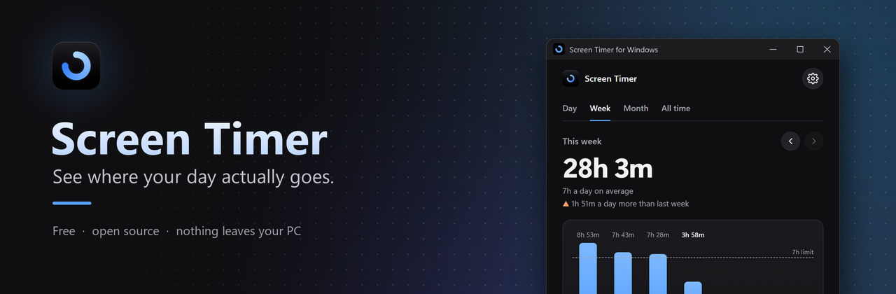
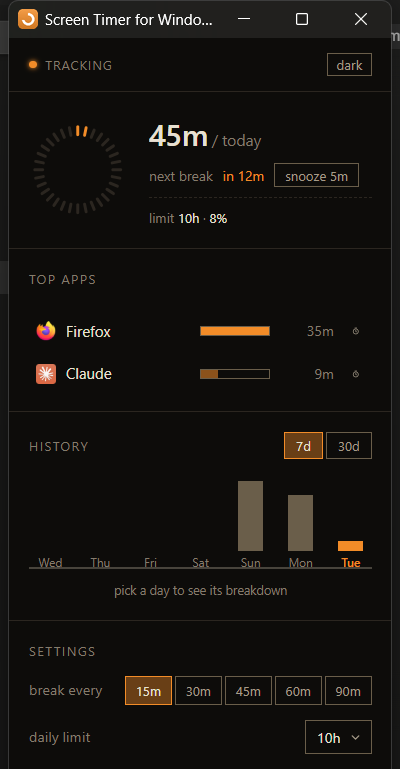
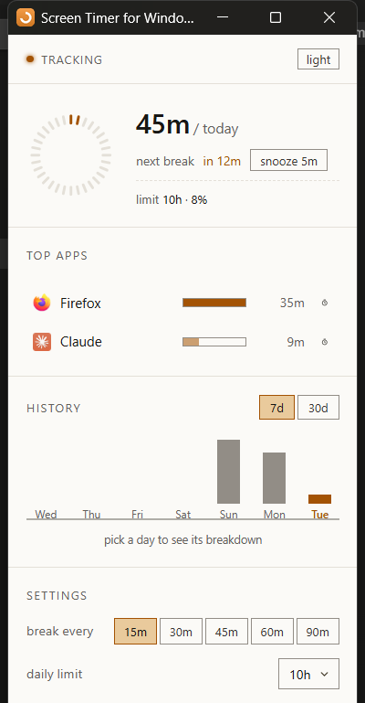

# Screen Timer for Windows

A screen time tracker for your laptop. It sits quietly in your taskbar, shows
you which apps actually ate your day, and nudges you to take breaks.

Free, open source, and completely private. No account, no sign up, and nothing
ever leaves your computer.

<table>
<tr>
<td></td>
<td></td>
</tr>
</table>

---

## Download and install

**[⬇ Download ScreenTimer.exe](../../releases/latest/download/ScreenTimer.exe)**

1. Click the link above to download the file
2. Double-click the downloaded `ScreenTimer.exe`
3. That's it, it's running

There's no installer and nothing to set up. It starts tracking straight away
and puts a small orange icon in your taskbar.

### If Windows shows a blue warning

You'll probably see a blue box saying **"Windows protected your PC"**. This is
normal and doesn't mean anything is wrong.

Click **More info**, then click **Run anyway**.

<details>
<summary>Why does that warning appear?</summary>

Windows shows it for any app that hasn't been signed with a paid certificate,
which costs hundreds of pounds a year. Almost every small free app gets this
warning, regardless of whether it's safe.

If you'd rather not take my word for it, all the code is public in this repo.
You can [see exactly what's in it](#whats-actually-inside), or
[build it yourself](#build-it-yourself) and never touch my download.

</details>

### Where to find it once it's running

Look at the **bottom right of your taskbar**, near the clock. There'll be a
small orange circle icon. Click it to open the window.

If you can't see it, click the small **^** arrow next to the clock, it may be
tucked in there. You can drag it out onto the taskbar to keep it visible.

---

## How to use it

| What you want | How to do it |
|---|---|
| Open the window | Click the orange icon in your taskbar |
| Close the window | Click X. It keeps tracking in the background |
| Quit completely | Right-click the tray icon, then Quit |
| Switch dark/light | The button at the top right of the window |
| See another day | Click any bar in the History chart |

### Settings

Everything is at the bottom of the window.

- **Break every** sets how often it reminds you to step away
- **Daily limit** is your target for the day. The dial fills up as you get
  closer to it
- **Per-app limits** are set by clicking the small icon at the right of any
  app in the list

### Stop it starting automatically

It adds itself to your startup apps so you don't have to remember to open it.
To turn that off:

Open **Task Manager**, go to the **Startup apps** tab, find **Screen Timer**,
and click **Disable**. It won't turn itself back on.

### Uninstalling

There's no installer, so there's nothing to uninstall. To remove it completely:

1. Right-click the tray icon and choose **Quit**
2. Task Manager → Startup apps → Screen Timer → **Disable**
3. Delete `ScreenTimer.exe`
4. Delete the folder `%APPDATA%\ScreenTimer` (paste that into File Explorer's
   address bar to find it)

Nothing else is touched, and nothing is left behind in Program Files.

---

## How the counting works

Reasonable question if you're on a laptop with fifteen things open at once:
what does "1 hour" actually mean?

Every second, it checks which window you're currently using, and gives that one
second to that one app. That's the whole rule.

So having lots of windows open doesn't inflate your numbers. Only one window can
be in focus at a time, which means a second only ever counts once. Your daily
total is always exactly the sum of your apps, never more.

It also stops counting after 60 seconds of no typing or mouse movement, so
going for lunch doesn't quietly add screen time. It doesn't count while your
laptop is asleep either.

One thing worth knowing: this measures your attention, not what's running in the
background. Music playing while you work counts as whatever you're working in,
and a download running for three hours counts as nothing. Your phone measures it
the same way.

---

## Your data and privacy

Everything is stored in one folder on your own computer:

```
%APPDATA%\ScreenTimer\
```

Paste that into File Explorer's address bar to see it. Your history is a plain
readable file, roughly 370 bytes per day, so a full year of use takes about
130 KB. Delete that folder and your history is gone.

It ignores Windows system things like the lock screen, Start menu and search, so
your list only shows apps you actually chose to open. It doesn't count itself
either.

Nothing is uploaded, nothing is shared, and there's no account. See below for
how to verify that yourself.

---

## What's actually inside

Fair enough if you'd like to check before running a download. Here's everything,
about 1,300 lines in total.

**The two folders**

| Folder | What's in it |
|---|---|
| `assets/` | Pictures. The app icon, the banner and the screenshots |
| `ui/` | The window itself. `index.html` is the layout, `style.css` the colours, `app.js` the clicking |

**The main app**

| File | What it does |
|---|---|
| `main.py` | The heart of it. Tray icon, window, the loop that counts each second, notifications |
| `storage.py` | Reads and writes your data, handles the day rolling over, ignores system apps |
| `api.py` | Passes messages between the window and Python |

**Small helpers, one job each**

| File | What it does |
|---|---|
| `idle.py` | How long since you touched the keyboard |
| `active_window.py` | Which app is in focus right now |
| `runtime.py` | The break countdown |
| `paths.py` | Where files live, bundled vs. your own data |
| `icons.py` | Pulls real icons out of other apps |
| `icon_art.py` | Draws the orange badge |
| `autostart.py` | The start-on-login setting |
| `first_run.py` | First-launch setup |

**Build files:** `screen-timer.spec` and `version_info.txt` are the recipe for
turning the source code into the `.exe`.

**What it does not contain:** any networking code at all. There's no `requests`,
no `urllib`, no sockets, and no web addresses it calls. The app physically
cannot send your data anywhere, because there's nothing in it capable of
talking to the internet. Search the repo yourself if you like.

The window is a local HTML page shown through
[pywebview](https://pywebview.flowrl.com/) using Windows' own built-in WebView2,
so there's no browser bundled inside it either.

---

## Build it yourself

You'll need Python 3.11 or newer on Windows.

```bash
git clone https://github.com/arihantslittlecave/screen-timer-for-windows.git
cd screen-timer-for-windows
pip install -r requirements.txt
pyinstaller screen-timer.spec
```

Your `.exe` will appear in the `dist` folder. Or run it straight from the source
without packaging anything:

```bash
python main.py
```

---

## Something not working?

This has been built and tested on one machine, mine. Windows being Windows,
there's a fair chance something behaves differently on yours.

If it doesn't work, or the tray icon won't appear, or it does something odd,
**[open an issue](../../issues/new)** and tell me what happened. I'll fix it.
I genuinely want to know.

It helps a lot if you include the contents of:

```
%APPDATA%\ScreenTimer\screen-timer.log
```

That's where the app writes down what it was doing when things went wrong.

---

## Licence

MIT, so do whatever you like with it. See [LICENSE](LICENSE).

Built by [arihant](https://github.com/arihantslittlecave).
